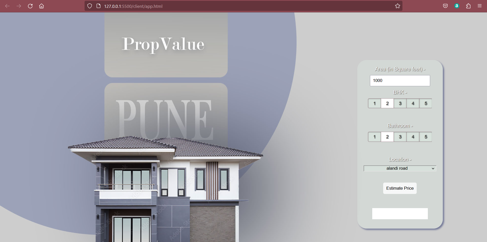

# PropValue Pune
PropValue Pune is a project aimed at determining the approximate price of houses in Pune, India, based on various input parameters such as square footage, number of bathrooms, number of bedrooms (BHK), and location.
 
## Technologies Used
Python,
Jupyter Notebook,
Pandas Library,
Matplotlib, Scikitlearn, Photoshop, Flask, HTML, CSS, and JavaScript
  

## Project Overview
The project follows the following steps:

### Exploratory Data Analysis (EDA):
 Analyzing the Pune house data to gain insights and understand the relationships between variables.
### Data Visualization: 
Creating visualizations to present the data in an easily understandable format.
### Feature Engineering: 
Transforming the existing features and creating new features to improve the predictive power of the model.
### Train-Test Split:
 Splitting the data into training and testing sets to evaluate the performance of the model.
### Model Building:
 Developing a machine learning model to predict the house prices based on the given input parameters.
### Model Evaluation: 
Assessing the accuracy of the model's predictions.
### Model Performance:
The trained model achieved an accuracy of 81% in predicting house prices in Pune. This accuracy metric provides an indication of how well the model performs in estimating the prices based on the given input parameters.
 

# Web Application
The project includes a web application built using Flask, HTML, CSS, and JavaScript. The web application allows users to input the square footage, number of bathrooms, number of bedrooms, and location in Pune to obtain an approximate price for the house.

 

